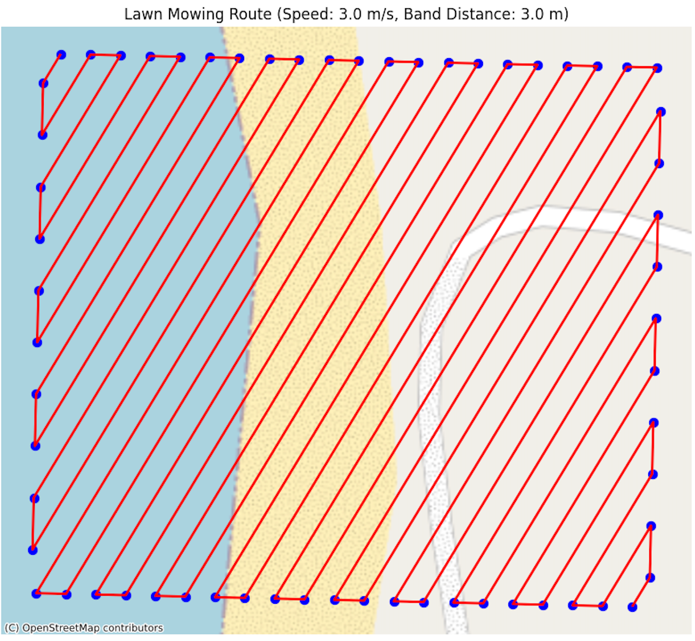

# BOK UcGS fishing route (for drone)

Our purpose is to create a route for a Matrice 350RTK to pull an underwater camera for photogrammetry.

UcGS tool is a classic tool to do so, but theflaying pattern is a bit special:
 * Altidude is not alitude as the camera is not on the drone but pulled with a 6m pole at an angle of roughly 60 degrees
 * More cumbersome, the drone cannot make sharp turns as usually is does in photogrammetry flight plan, because the pole is tool long for that.
 * The water entry phase is critical and must play on spped ond altitude

## The problem

Give a rectangle coordinates, the distance between two band, a flying angle, speed, and altitude, the program will output a flight plan.

### Constraints
 * We shall not make turn sharper than 90 degrees
 * if a turning radius is given, we shall not make a turn between two bands which are closer than twice this radius (and the turning route shall be approximately a circle)

### WIP flying pattern
The flying path looks something like below. BEWARE that this example is parlty on land, in order to have know map overlay for testing (else, water is blue all over)

## Dev
This project was a discovery of Junie in Jetbrains (Cursor-type tool) when you enter [tasks](docs/tasks.md) and [guidelines](.junie/guidelines.md).

I am still reflecting on [what I learned](docs/junie-lessons.md)