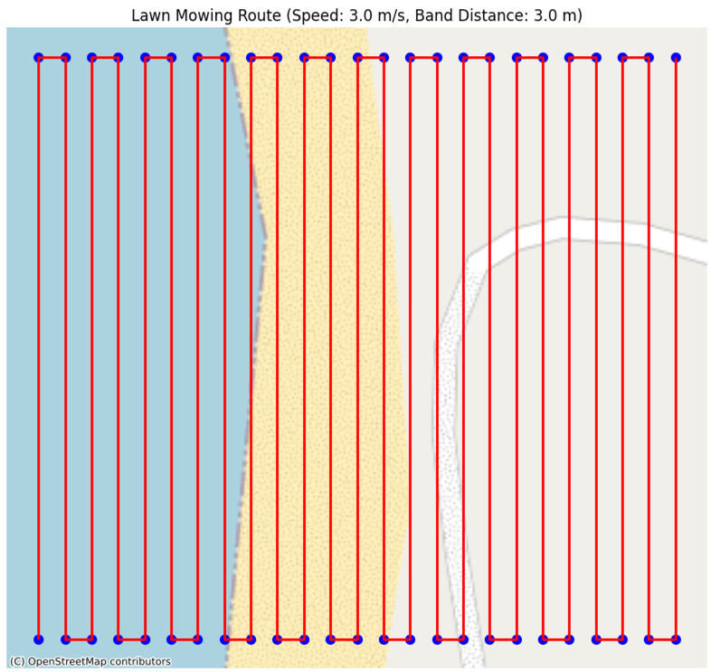
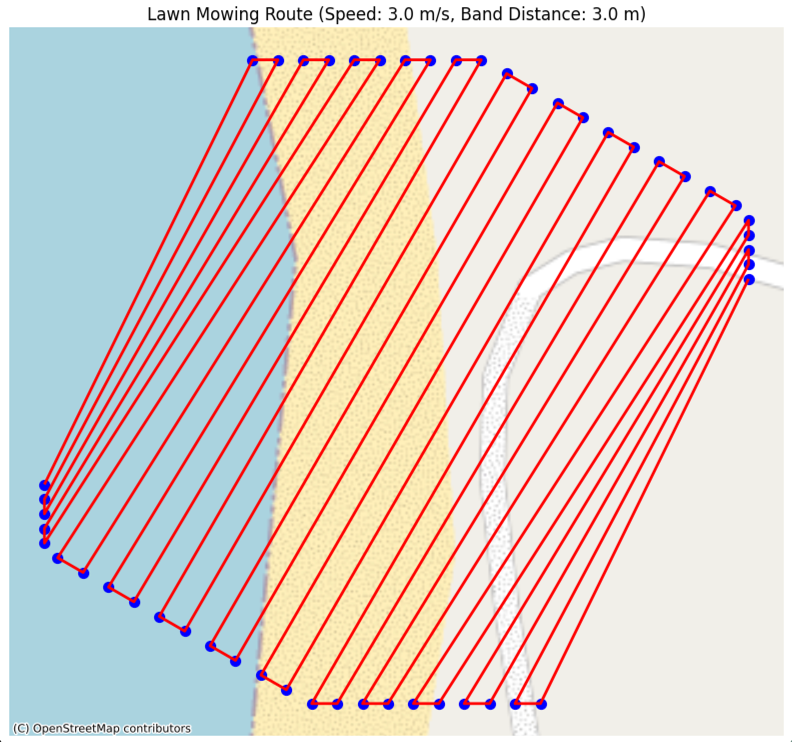
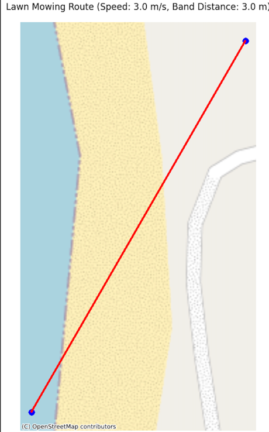

# Tasks

* [x] create a function to transform WGS coordinates in to radians coordinates
  * Fixed implementation to use math.radians() instead of pyproj to avoid CRS errors
* [x] create a WaypointCoordinate class with lat, lon, and altitude. 
* [x] create a RouteSegment which is a list of WaypointCoordinates and a speed in m/s.
* [x] in route_planner package, create a `create_route_segment_perimeter` function that is given two corners of a rectangle in WGS coordinates, a speed and returns a RouteSegment that pass through the 4 corners of the rectangle.
* [x] in the exporter package, create a function that takes a RouteSegment, an EPSG code to set the CRS and exports to a png image, with an openstreetmap base layer.
* [x] make a flask command line app that takes two corners longitude latitude in WGS84 and a speed, create a perimeter route segment and returns a png image.
* [x] in route_planner package, create a `create_route_segment_lawn_mower` function that
  * is given two corners of a rectangle with a EPSG code (default WGS84), a speed, and a distance between two bands.
  * Returns a RouteSegment. 
  * The route is delimited by the 4 corners of the rectangle.
  * it must fly on parallel bands.
  * The distance between two band is at maximum distance given (or the highest one dividing the rectangle, but lower than the given).

* [x] change the flask command line app generate-perimeter-map to generate-lawn-mowing, with a extra parameter for the distance between two bands.
* [x] add an angle in degree for lawn mowing. 0 is South -> North, 90 is East -> West.
* [X] BUG: lawn mowing with an angle:
  * the lines must be paralel to the angle.
  * the waypoints must be on rectangle perimeter

* [X] BUG: You must cover the rectngle with lines at the specific angle

* [x] I see that you deal with coordinates setting latiude first and longitude second. In fact, you must refactor the code to stick to the standard x,y, which means longitude, latitude. Refactor all function call and return pairs to adapt to this standard.
* [x] in `coordinates.route.py` I want a function generating a `RouteSegment`, given a list of (float, float), an altitude and a speed
* [ ] In `route_planner` the function creating a RouteSegment
  * shall not have a `speed` parameter.
  * shall return a list of (float, float).
  * Where those function are called, we should invoke `create_route_segment_from_coordinates` with altitude and speed to create the final `RouteSegment`.