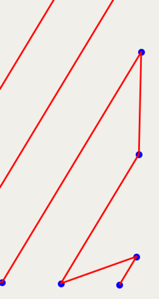
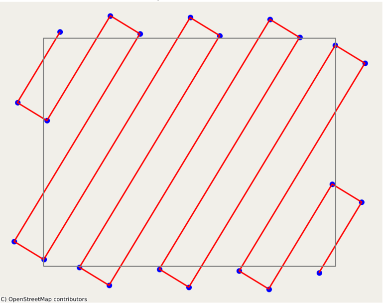

# Tasks

The tasks marked with an upper case X are completed by me, with a lower case x are implemented by me, and a dot is
implemented by Junie.

* [x] create a function to transform WGS coordinates in to radians coordinates
    * Fixed implementation to use math.radians() instead of pyproj to avoid CRS errors
* [x] create a WaypointCoordinate class with lat, lon, and altitude.
* [x] create a RouteSegment which is a list of WaypointCoordinates and a speed in m/s.
* [x] in route_planner package, create a `create_route_segment_perimeter` function that is given two corners of a
  rectangle in WGS coordinates, a speed and returns a RouteSegment that pass through the 4 corners of the rectangle.
* [x] in the exporter package, create a function that takes a RouteSegment, an EPSG code to set the CRS and exports to a
  png image, with an openstreetmap base layer.
* [x] make a flask command line app that takes two corners longitude latitude in WGS84 and a speed, create a perimeter
  route segment and returns a png image.
* [x] in route_planner package, create a `create_route_segment_lawn_mower` function that
    * is given two corners of a rectangle with a EPSG code (default WGS84), a speed, and a distance between two bands.
    * Returns a RouteSegment.
    * The route is delimited by the 4 corners of the rectangle.
    * it must fly on parallel bands.
    * The distance between two band is at maximum distance given (or the highest one dividing the rectangle, but lower
      than the given).
      
* [x] change the flask command line app generate-perimeter-map to generate-lawn-mowing, with a extra parameter for the
  distance between two bands.
* [x] add an angle in degree for lawn mowing. 0 is South -> North, 90 is East -> West.
* [X] BUG: lawn mowing with an angle:
    * the lines must be paralel to the angle.
    * the waypoints must be on rectangle perimeter
      
* [X] BUG: You must cover the rectngle with lines at the specific angle
  
* [x] I see that you deal with coordinates setting latiude first and longitude second. In fact, you must refactor the
  code to stick to the standard x,y, which means longitude, latitude. Refactor all function call and return pairs to
  adapt to this standard.
* [x] in `coordinates.route.py` I want a function generating a `RouteSegment`, given a list of (float, float), an
  altitude and a speed
* [x] In `route_planner` the function creating a RouteSegment
    * shall not have a `speed` parameter.
    * shall return a list of (float, float).
    * Where those function are called, we should invoke `create_route_segment_from_coordinates` with altitude and speed
      to create the final `RouteSegment`.
* [x] route_planner, assume that the function creating list of coordinates (create_route_segment_lawn_mower and
  create_route_segment_perimeter) are given coordinates in UTM coordinates (with metrics cartesian). As distance are
  small, we cann make this approximation
    * for the flask script, detect is the given coordinates are with (-180/180 and -90/90). If yes, assume that they are
      in WGS84 and convert them to the appropriate coordinates (reporting so in a logging info statement)
* [X] in `lawn_mower.py`, add a function that
    * takes as argument a rectangle defined by 2 corners, a point p= (x,y), a vector v=(dx, dy)
    * it returns the 0, 1 or 2 unique positions where the line p+v crosses the rectangle.
* [ ] in ugcs_exporter, implement the function `_route_segments_to_ucgs_route` that take a list of route segments an
  produce a UcGS route structure.
    * Here is an example of the UcGS route structure:
   ```json
   {
    "type": "Waypoint",
    "actions": [],
    "point": {
      "latitude": null,
      "longitude": null,
      "altitude": null,
      "altitudeType": "AGL"
    },
    "parameters": {
      "avoidObstacles": true,
      "avoidTerrain": true,
      "speed": null,
      "wpTurnType": "ADAPTIVE_BANK_TURN",
      "altitudeType": "AGL",
      "cornerRadius": null
    }
  }
  ```
    * You will therefore replace latitude, longitude, altitude, route segments wapoint
    * You will replace the sppeed from the segment speed
* [x] fix `_route_segments_to_ucgs_route` so that it takes an EPSG code as argument and ensure the ucGS
  latitude/longitude are in radians.
* [X] append soft water landing and take off to the scannig route
* [X] BUG when choosing next band travel, it chooses the closest of the two points. SHould take into account the angle.
  
* [x] in `lawn_mower.py`, implement `is_perpendicular_ahead_of_strip`function based on the provided docstring
* [x] refactor `export_route_segment_to_png` function to add a grey rectangle border around the passed area corners. The
  area corners are passed by cli.py area. The must not be derived from the route.
* [x] in `lawn_mower.py`, implement `get_projection_point_on_strip` that wil compute the point perpendicular projection
  on the line given by the strip vector
* [X] make the land mowing trajetory so that it does not make angle turn lower than 90 degres.
  
* [x] for two strips (either a vector of two points or a point and None). We assume that if they are two vectors, they
  are parallels. Compute the distance between the lines, the point and a line, the line and a point or the two points.
  Do that in lawn_mower.py and name the function distance_strips.
* [X] create a function to reorder strips in a way that
    * a jump from one to the other is not shorter than a turning radius *2
    * The overall path is the shortest possible
    * You have the right to create extra strips
* [x] implement function `create_parallel_strip` accoring to the provided docstring
* [x] refactor function `distance_strips` into `signed_distance_strips`
  * the distance is negative if the second strip is on the left of the first one, positive it is on the right.
  * if the two stripc are points, distance is positive